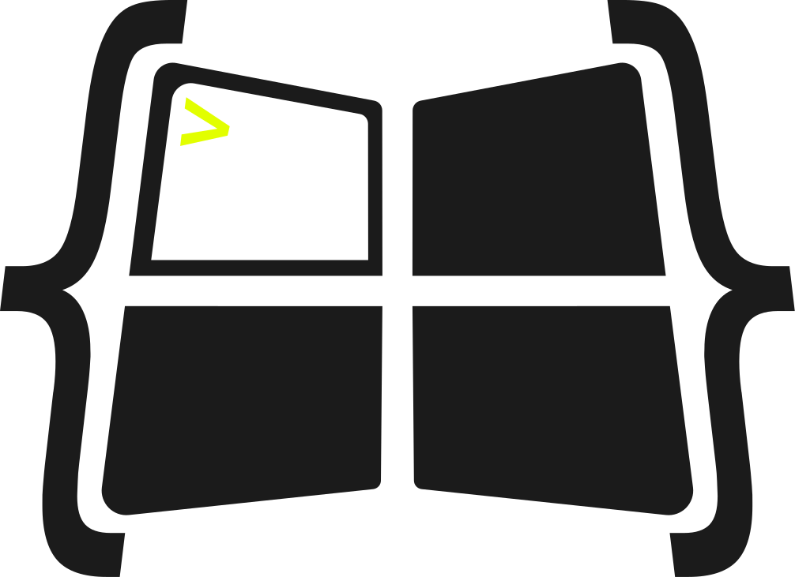

  <picture>
    <source media="(prefers-color-scheme: dark)" srcset="icon/Muxley.svg">
    
  </picture>

<h1 align="center">Muxley</h1>

<strong>Keep your AI coding agents in view.</strong>

Muxley is a macOS menu-bar app. It launches your terminal sessions and watches the AI coding
agents running inside them. It tells you the moment an agent is **blocked** and needs your
input, or has **finished**. You don't need to check every terminal tab to see if an agent is
still working.

Muxley does two things:

- **Launches sessions.** Set up a session once (its windows, its split panes, the command
  each pane runs). Then start it in your terminal with one click.
- **Watches your agents.** A colored menu-bar icon, a live popover with activity for each
  pane, and native notifications tell you which agent needs you, and when.

Today Muxley understands **Claude Code** and **opencode**. Support for more agents is
coming. A session can also just run normal commands, so Muxley works as a fast session
launcher even if you don't use an AI agent.

Muxley lives in the menu bar. A Dock icon and menus only show up while one of its windows is
open.

> **Beta:** Muxley is in active beta. Things may still change. We'd love your feedback, see
> [Feedback](#feedback) below.

---

## Features

- **Agent status at a glance.** The menu-bar icon changes color to match your busiest agent.
  Red means an agent is blocked and needs you. Yellow means one has finished. Green means
  agents are working.
- **A live popover, not just an icon.** See every session and its processes, each with a
  status dot and live activity. Hover any row to preview its last output.
- **One-click layouts.** Save a session template once. Launch it any time you need it.
- **Capture what's already running.** Turn a running session into a reusable layout.
- **A visual Session Editor.** Build windows and split panes, and set each pane's command,
  folder, and title. Undo, redo, and Save As are all supported.
- **Notifications that don't pile up.** One notification per agent. It updates in place and
  goes away once the agent no longer needs you. Click it to jump to that pane.
- **Keyboard-first, and global.** Move through the popover with arrow keys. You can also set
  a system-wide shortcut to open it from any app.
- **Real status, not a guess.** Agents can report their own state. Muxley can also install
  Claude Code hooks with one click, so working, blocked, and finished stay accurate even when
  the model forgets to say so. If neither is set up, Muxley reads the pane instead.

---

## What you'll need

- **macOS 14 (Sonoma) or later**, on an **Apple Silicon** Mac.
- **A terminal app.** Muxley works with several popular ones, and always falls back to the
  built-in Terminal app.
- *(optional)* An AI coding tool like **Claude Code** or **opencode**, only needed if you
  want agent monitoring.

---

## Install

1. Download the latest `Muxley.app` from this repo's
   [Releases](../../releases) page.
2. Drag it into your **Applications** folder.
3. Open it. Muxley isn't notarized yet, so macOS will block a normal double-click the first
   time. Right-click the app, choose **Open**, then confirm. You only need to do this once.

---

## First run

The first time you open Muxley, it opens **Settings** so you can get set up. You can reopen
Settings any time with the gear icon in the menu-bar footer. From there you can pick your
terminal, set a global shortcut, turn on agent self-reporting, and choose whether Muxley
starts at login.

---

## Using Muxley

Click the menu-bar icon, or use your global shortcut, to open the **popover**. It shows
everything running, grouped by saved layout. Click a row to jump to that pane. Hover a row
to preview its recent output.

Use the **Sessions window** to manage your layouts. You can create new ones, capture a
running session as a layout, and launch, edit, rename, or delete existing ones.

When an agent changes state, you get a native notification. 🔴 means it needs you. 🟡 means
it finished. Click a notification to jump to that pane.

---

## Beta & pricing

Muxley is **free to use during the beta**, with no limits.

Once the beta ends, the free version will have some limits, such as fewer active sessions
and session windows than the full app. A paid license that removes these limits is coming soon. Support for connecting to remote machines is also planned, and will only be part of
the full, licensed app.

---

## Supported terminals

Muxley checks which of these you have installed and picks the best one. You can also choose
one yourself in Settings. Let me know if I am missing your terminal.

- Ghostty (preferred if installed)
- WezTerm
- kitty
- Warp
- iTerm2
- Alacritty
- Terminal (always available as a fallback)

---

## Troubleshooting

**"Muxley can't be opened"** — this happens on first launch because the app isn't notarized
yet. Right-click the app, choose **Open**, then confirm. You only need to do this once.

---

## Feedback

Muxley is in beta, and we'd love to hear from you. Bug reports, rough edges, and feature
ideas are all welcome. Please open an issue on this repo's
[GitHub Issues](../../issues) page.

---

## License

Muxley is proprietary software. © S+J Perelson. All rights reserved. No license is
granted to use, copy, modify, or redistribute this software or its source, in whole or in
part, without prior written permission.

The one exception is the third-party software Muxley bundles, listed below.

---

## Third-party software

Muxley bundles a self-contained copy of **tmux**, built with **libevent**, **ncurses**, and
**utf8proc**, so it works on Macs that don't have tmux installed. All four use permissive
licenses. Their full copyright and license text is shipped inside the app at
`Contents/Resources/THIRD-PARTY-LICENSES.txt`.

Muxley also builds on three open-source Swift packages:
[Yams](https://github.com/jpsim/Yams) (YAML) and
[KeyboardShortcuts](https://github.com/sindresorhus/KeyboardShortcuts) (the global hotkey),
statically linked into the binary; and
[Sparkle](https://github.com/sparkle-project/Sparkle) (the auto-updater), whose framework is
bundled inside the app. Each is distributed under its own permissive license. See its
repository for the details.
